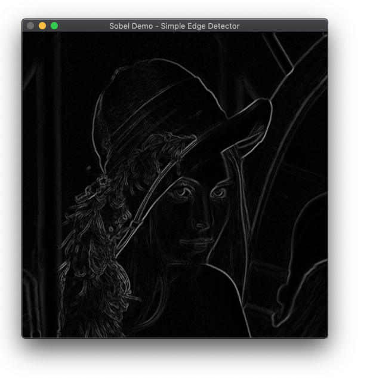

# Sobel-Edge-Detector-C++

Edges Feature Detection by Sobel algorithm implementation using C++ and OpenCV

## Usage
- Install OpenCV C++ Version
- Change Directory to Repo Directory
- Run the following Command in Terminal 
"g++ $(pkg-config --cflags --libs opencv4) -std=c++11  Sobel_Demo.cpp -o Sobel_Demo"
- Execute Unix File Generated using the following Command
"./Sobel_Demo"

